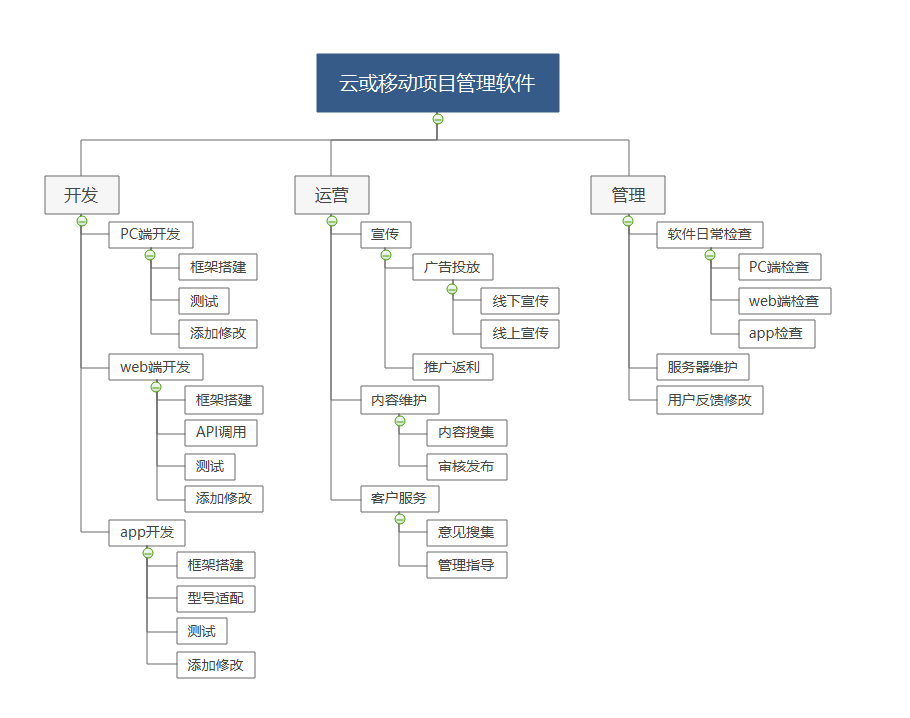
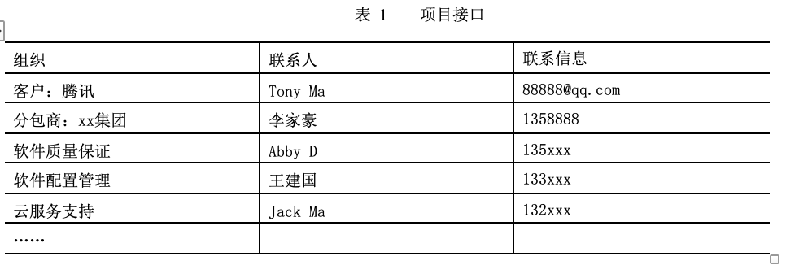
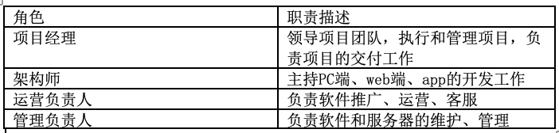

# 项目管理计划

## 1 简介

### 1.1 项目概述

项目目标：实现一个提供在线项目管理服务的软件，通过云或移动端提供服务。

发布产品：项目管理软件app；项目管理软件web端；项目管理软件PC端。

主要工作活动：需求分析、产品设计、产品发布、产品维护。

主要工作制品：需求分析文档，软件设计文档，软件使用手册，商业计划书，软件源代码。

关键里程碑：至6.25收集资料，完成需求分析；7.10前完成项目设计文档；7.25前开发PC端原型，搭建基本框架；至8.5完成内部测试，完善服务；至8.25完成web端，app开发；至9.10完成内部测试；9月进行开放测试，收集反馈；9.31正式交付。

所需资源：开发团队补助、服务器租金。

### 1.2 项目交付产品

PC端项目管理软件源代码及技术文档：8.5交付，能承担10000以下用户同时使用，流畅运行无漏洞。

web端项目管理软件源代码及技术文档：9.10交付，能承担10000以下用户同时使用，流畅运行无漏洞，适配主流浏览器。

项目管理软件app源代码及技术文档：9.10交付，能承担10000以下用户同时使用，流畅运行无漏洞，适配主流手机型号。

### 1.3 SPMP的演化

2020.6.22 由17343030高镇、王玥琪、吴翠萍编写1.0版本，并负责后续进行维护。

## 2 项目组织

### 2.1 过程模型

过程采用瀑布模型，项目人员分为三个不同的团队分别负责开发、运营、管理，各团队负责人将任务向下分派，通过测试完成开发进行交付，运营管理团队完成前期工作，形成固定的运维模式，项目即结束。

### 2.2 组织结构

### 2.3 组织接口

### 2.4 项目职责

## 3 管理过程

### 3.1 管理目标和优先级

#### 3.1.1 管理目标

基本管理原则：每位成员既是积极的建言者，又是负责的合作者，同时也是决策的制定者。决策应在充分的讨论基础上由大家共同做出，一旦决策做出就必须被及时有效的执行。禁止再有异议。

目标 1：按时按量完成项目的基本功能，按时发布产品及文档，这是本团队的最高目标。

目标 2：遵循规范化的项目运作标准，文档严谨完整，代码注释充分，便于后续维护，这是第二目标。

目标3：产品运行稳定，界面友好，用户易操作，尽量从用户的角度去看问题，并提出解决问题的方案。

目标4：注重团队建设，成员分工合理，团队成员合作默契，气氛融洽。每周的讨论会积极建言。在开发过程中积极协作。 

目标5：项目设计和开发上尽量有创新，有亮点。

#### 3.1.2 优先级

在遵循基本管理原则的基础上，管理目标的优先级如下：

| 管理目标 | 优先级 |
| :------: | :----: |
|  目标1   |   1    |
|  目标2   |   2    |
|  目标3   |   3    |
|  目标4   |   4    |
|  目标5   |   5    |

### 3.2 假设、依赖关系和限制

假设1：因结课时间变动需要对项目进度进行压缩

限制：某些模块或功能不能及时交付

假设2：线上办公合作造成流程交接有误

限制：某些模块或功能由于失误需要重做，拖延进度

假设3：找不到美工指导

限制：网页端、PC端、App端的UI不够美观

### 3.3 风险管理

​	本次开发中存在的风险类型及规避方法：

|   风险类型   |                             内容                             |                           规避方法                           |
| :----------: | :----------------------------------------------------------: | :----------------------------------------------------------: |
|   进度风险   |              由于整体课时比较短导致无法按时完成              | 1.任务拆解要详细可落实、便于跟踪进度；2.执行过程中，强调项目按照进度推动的重要性，当考虑新的需求时，将保证进度作为先决条件。3.如果出现必须延期的情况，负责人应即使与ta或老师沟通，申请延长时间。 |
|              |                         测试时间不足                         | 持续监控，项目进度控制随项目进行而一直进行，保证每个环节都有足够时间。 |
|   需求风险   |        分析员对业务了解不全面，使系统不能满足业务需求        |           根据成员反馈情况修改，让用户确认需求报告           |
|              |                  需求不断变化，项目没完没了                  |                  讨论决定，建立范围变更程序                  |
|   技术风险   |      开发者缺乏技术培训，缺少经验，项目功能不能完全实现      |                       定期开培训交流会                       |
|              |          部分模块功能不能及时交付，无法满足用户需求          |                  设立沟通反馈机制，追加模块                  |
|              |                   设计错误导致程序实现困难                   |                修改设计，开发之前进行设计评审                |
|              |                         缺少测试计划                         |                      追加测试计划并评审                      |
|              |                         缺少质量跟踪                         |                       制定质量跟踪计划                       |
|   工具风险   | 项目开发和实施过程所必须用到的开发工具、管理工具未能及时到位 | 在项目启动阶段落实各项工具来源或可替代的工具，在项目开发之前设计并搭建出系统的基础架构并进行性能测试，确定架构符合性能指标再进行后续工作 |
| 人力资源风险 |                    人力资源有限，经验不足                    |        求助外援，比如技术、项目管理专家，做好人员培训        |
|   用户风险   |         用户对最终交付的产品不满意，要求重新设计开发         | 修改设计，每进入下一步之前都拿出可交付的产品与客户沟通，避免需要产生巨大的变更 |

### 3.4 监督和控制机制

#### 3.4.1 报告机制

各项目推进过程负责人以两周为单位记录工作进展，形成文档报告。股责任在每次会议时口头总结，项目组成员给出意见，修改报告。风险负责人密切监控风险状态，必要时开小组会议作出临时决定。

#### 3.4.2 监督机制

技术组负责人对开发过程进行监督并提供技术支持，管理组负责人把握整体进度。

#### 3.4.3 评价和审核机制

每次小组会议中形成一致意见即为通过，每一里程碑前后组织一次阶段评审会，评估整个阶段的工作效率和交付物质量，需要时邀请ta或老师参加评议。

### 3.5 人员计划

项目人力资源计划表：（日后填充、不需要则删除）

| 序号 | 岗位名 | 相关WBS | 负责工作 | 专业技能水平要求 | 时间投入 | 人选 |
| :--: | :----: | ------- | :------: | :--------------: | :------: | ---- |
|      |        |         |          |                  |          |      |

## 4 技术过程

#### 4.1 方法、工具和技术

技术栈：SprintBoot+Thymeleaf+Bootstrap+Mysql

项目采用面向对象的分析设计方法，采用UML进行系统建模，开发过程严格使用统一的文件命名命名方式、变量名命名方式、注释等代码规范；测试人员根据测试文档进行测试，最终完成产品交付。

### 4.2 产品需交付的文档

#### 4.2.1 软件项目管理计划

文档由小组合作完成，阐述整个项目的推进管理过程。该文档在产品设计需求分析初级阶段完成， 后续由各模块成员进行相应的更新

#### 4.2.2 需求规格说明初稿

在需求分析阶段，由需求分析小组成员采集分析用户需求，并在会议作出决策，撰写整理需求规格说明初稿，并在后续各阶段进行需求变更的更新

#### 4.2.3 设计报告初稿

在总体设计阶段，根据规格说明文档完成软件体系结构的设计，并在后续开发阶段补充和更新。该文档由相应模块负责人维护更新。

#### 4.2.4 测试文档

在产品开发阶段，测试人员负责编写测试规格说明文档，并在后续测试阶段更新。开发人员根据测试规格说明文档搭建测试环境、准备测试样例。

#### 4.2.5 用户手册

测试人员负责着手编写，并在需求分析结束后形成初稿，后续需要不断维护，在提交产品时一起被交付。

#### 4.2.6  个人项目总结

组内成员各自独立完成，对项目推进的整个过程进行分析总结，也可以提建议，在交付产品时一并提交。

#### 4.2.7 其他文档

开发过程中的其他文档，如项目推进周报、开发日志、测试日志、遇到问题的处理流程和意见等，整合提交后作为日后项目开发及交流的经验。

## 5 工作包、进度表和预算

### 5.1 工作包

| 工作包编号 | 工作包内容   | 所耗时间  | 详情及备选方案 |
| ---------- | ------------ | --------- | -------------- |
| 001        | 需求分析文档 | 7days     |                |
| 002        | 项目设计文档 | 15days    |                |
| 003        | PC端前端     | 10-15days |                |
| 004        | PC端后端     | 10-15days |                |
| 005        | web端前端    | 10-15days |                |
| 006        | web端后端    | 10-15days |                |
| 007        | app前端      | 10-15days |                |
| 008        | app后端      | 10-15days |                |
| 009        | 内部测试     | 10days    |                |
| 010        | 开放测试     | 20days    |                |
| 011        | 正式交付     | -         |                |

### 5.2 依赖关系

### 5.3 资源需求

* 人员

  * 项目经理：1人
  * 架构师：PC端、web端、app各2-3名前后端人员
  * 测试人员：1-2人
  * 运营人员：1-2人
  * 管理人员：1-2人

* 办公室

  * 一间可容纳至少15人的办公室
  * 网线、饮水机等设备齐全

  * 至少15台PC

  

  

### 5.4 预算和资源分配

| 项目        | 预算分配 | 资源分配                              |
| ----------- | -------- | ------------------------------------- |
| 项目经理    |          | 0-1台PC，一个工作位                   |
| PC端工程师  |          | 一人一台PC（2-3台PC），一人一个工作位 |
| web端工程师 |          | 一人一台PC（2-3台PC），一人一个工作位 |
| App工程师   |          | 一人一台PC（2-3台PC），一人一个工作位 |
| 测试人员    |          | 一人一台PC（1-2台PC），一人一个工作位 |
| 运营人员    |          | 1-2台PC，1-2个工作位                  |
| 管理人员    |          | 1-2台PC，1-2个工作位                  |

### 5.5 进度表

| 时间安排               | 具体内容            | 其他 |
| ---------------------- | ------------------- | ---- |
| 需求分析文档           | before6.25          |      |
| 项目设计文档           | 6.25-7.10           |      |
| PC端及其测试           | 7.10-7.25，7.25-8.5 |      |
| web端、app开发及其测试 | 8.5-8.25，8.25-9.5  |      |
| 内部测试               | 9.5-9.15            |      |
| 开放测试               | 9.15-9.30           |      |
| 正式交付               | 10.1                |      |

## 6 其他

### 6.1 附录

[IT项目管理第一周作业.md](https://github.com/anjahappy/ProjectManagment/blob/master/Part1/IT项目管理第一周作业.md)

[云或移动项目管理服务软件调查分析.md](https://github.com/anjahappy/ProjectManagment/blob/master/Part2/云或移动项目管理服务软件调查分析.md)

[假想产品使用过程与描述.md](https://github.com/anjahappy/ProjectManagment/blob/master/Part2/假想产品使用过程与描述.md)

[项目盈利模式分析报告.md](https://github.com/anjahappy/ProjectManagment/blob/master/Part2/项目盈利模式分析报告.md)

